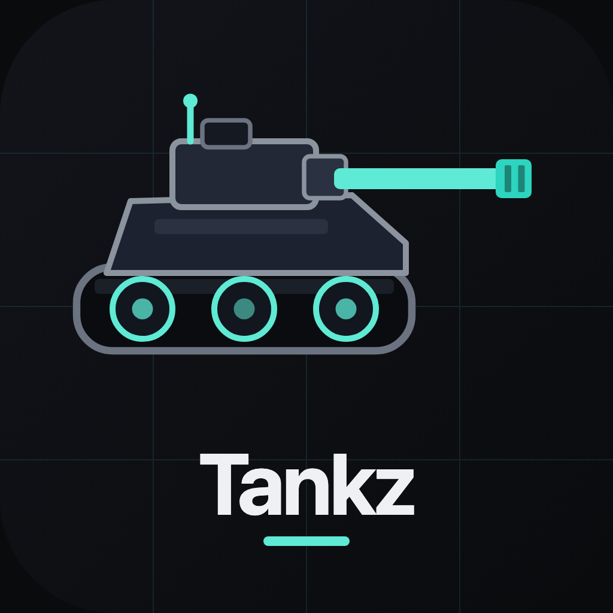

# Tankz

<p align="center">
  
</p>

<p align="center">
  <strong>Modern top-down tank combat.</strong><br />
  Blast enemy armor, climb endless levels, and claim the global Hall of Fame.
</p>

<p align="center">
  <a href="https://tankz-rho.vercel.app"><strong>Play Tankz →</strong></a>
  ·
  <a href="https://tankz-rho.vercel.app/privacy">Privacy</a>
  ·
  <a href="https://tankz-rho.vercel.app/terms">Terms</a>
</p>

---

## Features

- **Top-down tank combat** — drive, aim, and blast through waves of enemy armor
- **Arcade** and **Sim** control modes (pick your intensity)
- **Global Hall of Fame** — high scores saved server-side for everyone
- **Upgrades & missiles** — grow firepower as you push deeper
- **Desktop + mobile** friendly canvas gameplay
- Free to play

## Play modes

| Mode | Feel | Controls highlight |
| --- | --- | --- |
| **Arcade** | Snappy, nonstop fun | Screen-space WASD, infinite shells, Tab auto-target |
| **Sim** | Heavier, deliberate | Hull-relative drive, limited magazines, **R** to reload |

### Aim

- **Mouse** or **Q / E** to rotate the gun
- **M** toggles aim assist modes (where available)
- **Space** fires the main cannon · **F** fires missiles

## Stack

- [React](https://react.dev/) 19 + [TypeScript](https://www.typescriptlang.org/)
- [TanStack Start](https://tanstack.com/start) / Router / Vite
- Canvas game loop (custom engine under `src/game/`)
- [Postgres](https://www.postgresql.org/) via Neon in production (local PGLite fallback)
- [Better Auth](https://www.better-auth.com/) for optional sign-in
- Deployed on [Vercel](https://vercel.com/)

## Quick start

```bash
git clone https://github.com/mnease/tankz.git
cd tankz
npm install
npm run dev
```

Open the dev server URL from the terminal (default **http://localhost:8080**).

### Useful scripts

| Command | What it does |
| --- | --- |
| `npm run dev` | Dev server on `0.0.0.0:8080` |
| `npm run build` | Production build + DB migrations |
| `npm run typecheck` | TypeScript check |
| `npm run logo:make` | Regenerate brand SVGs/PNGs under `public/brand/` |
| `npm run og:make` | Regenerate `public/og.png` (1200×630 share card) |

### Environment

No `.env` is required for local play — the app falls back to **PGLite** and preview auth wiring.

For production / real Postgres:

| Variable | Purpose |
| --- | --- |
| `DATABASE_URL` | Neon (or other) Postgres connection string |
| Auth-related `VITE_*` / server secrets | Injected by the deploy host when sign-in is enabled |

Schema lives in `migrations/` (`0001_auth.sql`, `0002_leaderboard.sql`).

## Project layout

```text
src/game/          # Engine, levels, audio, main TankzGame UI
src/lib/           # DB, leaderboard, auth helpers
src/routes/        # Pages + API (leaderboard, auth, privacy, terms)
public/brand/      # Logo, wordmark, favicon assets
public/sprites/    # In-game tank & explosion sprites
migrations/        # SQL schema
scripts/           # Logo/OG generators, migrate, QA helpers
```

## Feedback

Questions or bugs? Email **[support@neasemedia.com](mailto:support@neasemedia.com?subject=Tankz%20Feedback)** or open a GitHub issue.

---

**Tankz** · NeaseMedia · [Play live](https://tankz-rho.vercel.app)
